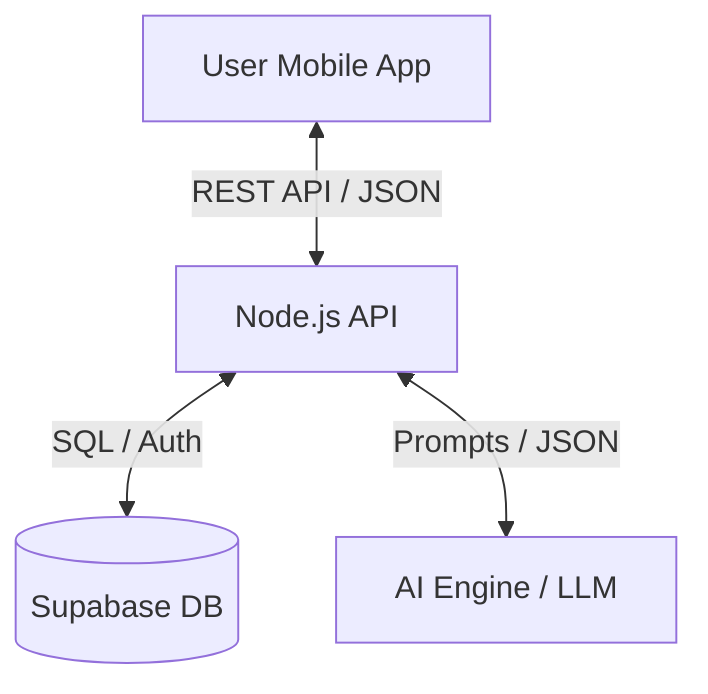

# AI-Powered Fitness App: System Design Document

## 1. Overview
A cross-platform mobile application providing AI-generated adaptive workout plans based on user profiles and sensor data.

## 2. Technology Stack
- **Frontend:** React Native (Expo)
- **Backend:** Node.js + Express
- **Database:** Supabase (PostgreSQL + Auth)
- **AI:** LLM API (OpenAI/Grok/Hugging Face)
- **Sensors:** Expo Sensors (Pedometer, Accelerometer)

## 3. Architecture Diagram (Conceptual)

## 4. Key Modules
### A. Authentication & Profile
- Managed by Supabase Auth.
- Stores: Age, Weight, Height, Fitness Goals, Level.

### B. AI Workout Engine
- Generates JSON-structured workout plans.
- Adapts to user history and sensor data.

### C. Activity Tracking
- Real-time step counting via Expo Sensors.
- Historical activity logs stored in Supabase.

## 5. Data Flow (Workout Generation)
1. User requests "Today's Workout".
2. Backend fetches User Profile + Last 3 Workouts + Recent Step Counts from Supabase.
3. Backend constructs a Prompt for the AI.
4. AI returns a structured Workout Plan.
5. Backend parses and saves the plan to Supabase.
6. Frontend displays the plan to the User.
